# JavaRPG

## Présentation

Dans ce répertoire vous pouvez trouver un projet de rpg réalisé en binôme durant ma troisième année de licence en informatique. Le projet consistait à créer un rpg en utilisant la librairie javafx en une semaine uniquement.

Dans ce jeu il vous est possible d'incarner des personnages provenant de quatre classes différentes pouvant s'équiper d'armes différentes, possédant des sorts propres à chacun et des statistiques différentes :
- Le Guerrier peut s'équiper d'une épée. Son permier sort permet de faire des dégâts en utilisant son arme et le deuxième permet d'attaquer plusieurs fois sans utilser son arme.
- Le Chevalier peut s'équiper d'une épee et d'un bouclier. Ses sorts sont similaires à ceux du Guerrier à la différence qu'attaquer avec son arme fera moins de dégâts que le Guerrier.
- L'Archer peut s'équiper d'un arc. Son premier sort permet d'augmenter le nombre de flèche qu'il a en stock et le deuxième permet de tirer de flèches.
- Le Mage ne peut pas s'équiper d'arme. Ses sorts lui permettent de dépenser du mana pour faire plus ou moins de dégât en fonction du taux de mana dépensé.

Les personnages commencent au niveau 1 et peuvent monter de niveau en tuant des monstres jusqu'à atteindre le niveau 100. Chaque montée de niveau augmentera les statistiques de votre personnage.
En plus de cela vous disposerez de 16 emplacements d'inventaire dans lequel vous pouvez stockez vos objets. Cet inventaire vous sera accessible depuis le menu principal mais aussi lors de vos combats.

Dans le jeu, il y a différents types d'objets :
- Des épées : offrent plus de dégats au sort d'attaque de Chevalier et du Barbare.
- Des boucliers : offrent plus de protection au Chevalier.
- Des arcs : permettent aux archers d'attaquer.
- Des potions : peuvent rendre du mana ou de la vie durant les combats.

Il y a toute une panoplie d'épées, de boucliers et d'arcs. Il y en a 100 de type normal du niveau 1 à 100, un troll de niveau 0, et 5 légendaires de niveau 20,50,80,100.
Les armes normales ainsi que les potions sont achetables dans la boutique, et les autres types peuvent être optenus en butin.

Si vous souhaitez combattre des montres, il existe 3 niveaux différents dans lesquels vous pouvez trouver 6 monstres différents et 7 boss. Chacun d'entre eux a des sorts différents et adapte sa stratégie en fonction des points de vie et du mana restant de l'adversaire. Chacun des ces montres a aussi un loot qui lui est propre.

## Résultats

| Main Menu | Menu Choice | Menu hub | Menu Level | Menu Shop | Menu Pause | Menu save |
|-|-|-|-|-|-|-|
| 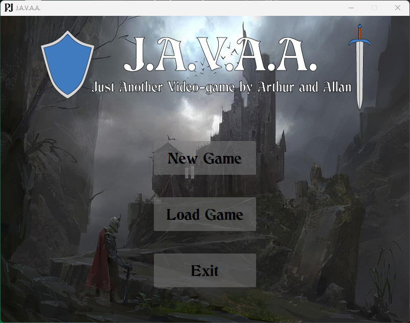 | 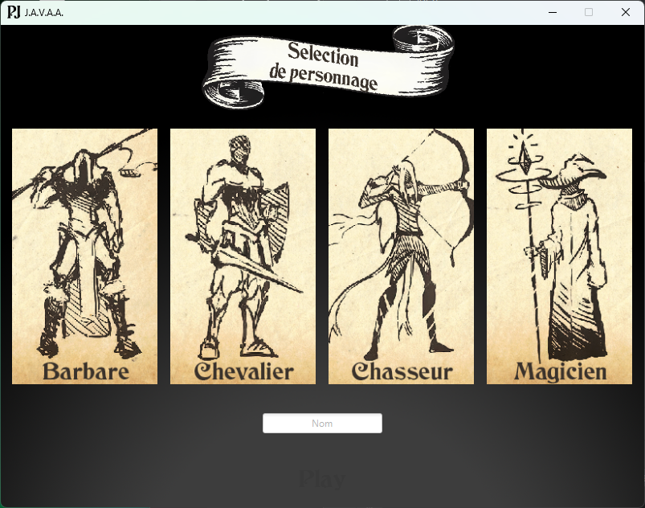 | 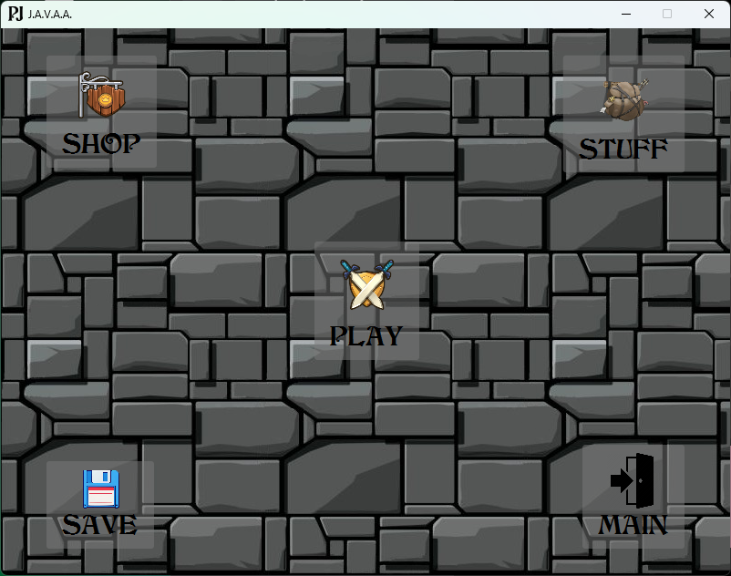 | 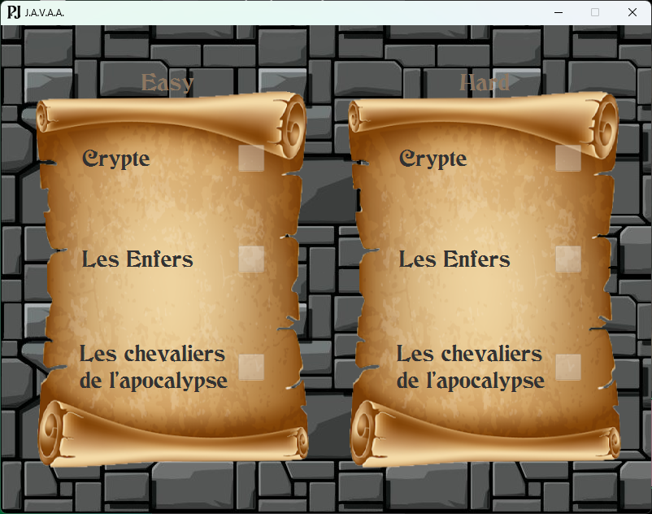 | 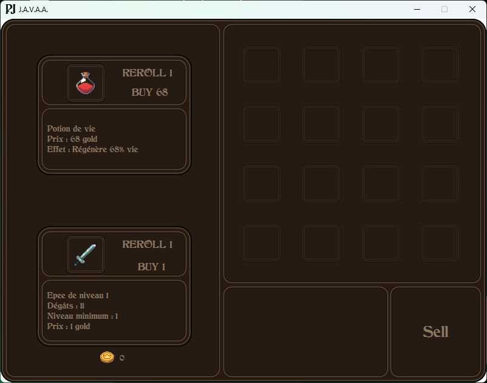 | 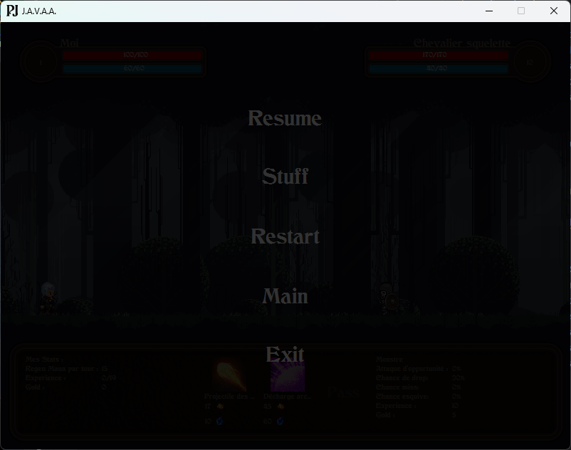 | 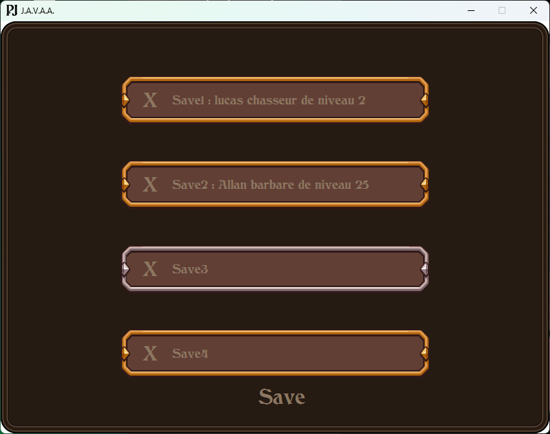 |

| Barbare | Chevalier | Archer | Mage |
|-|-|-|-|
| 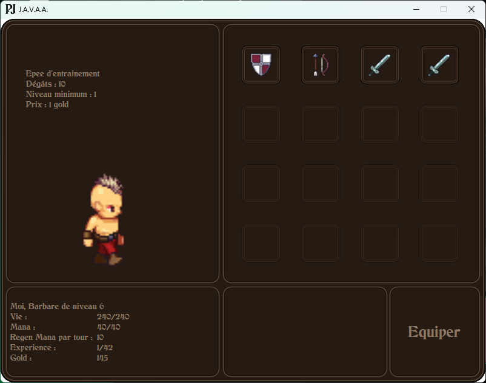 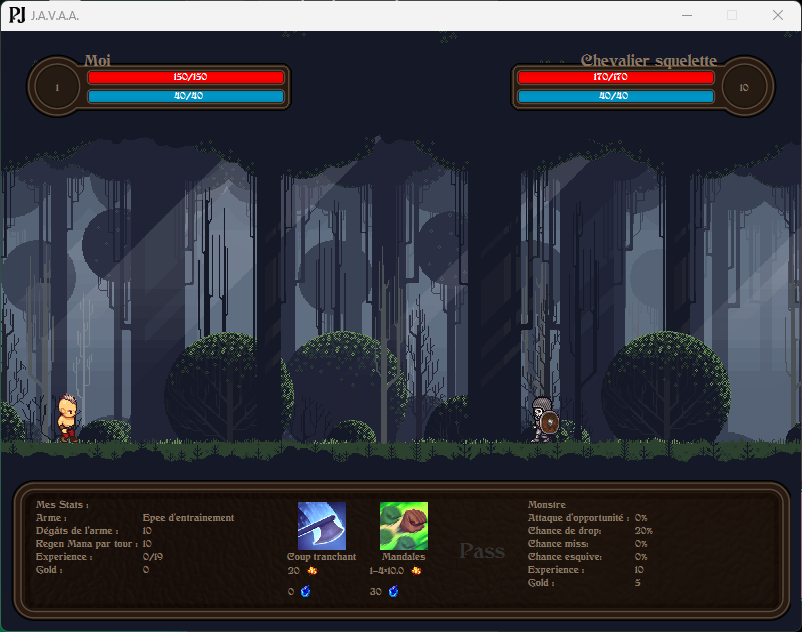 | 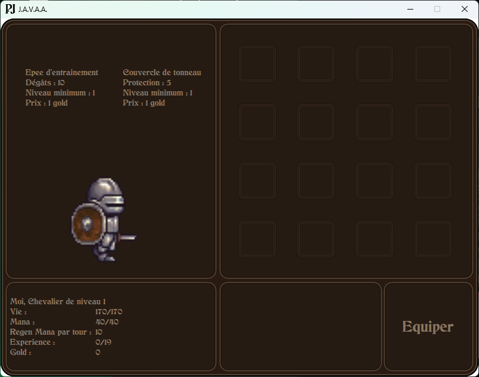 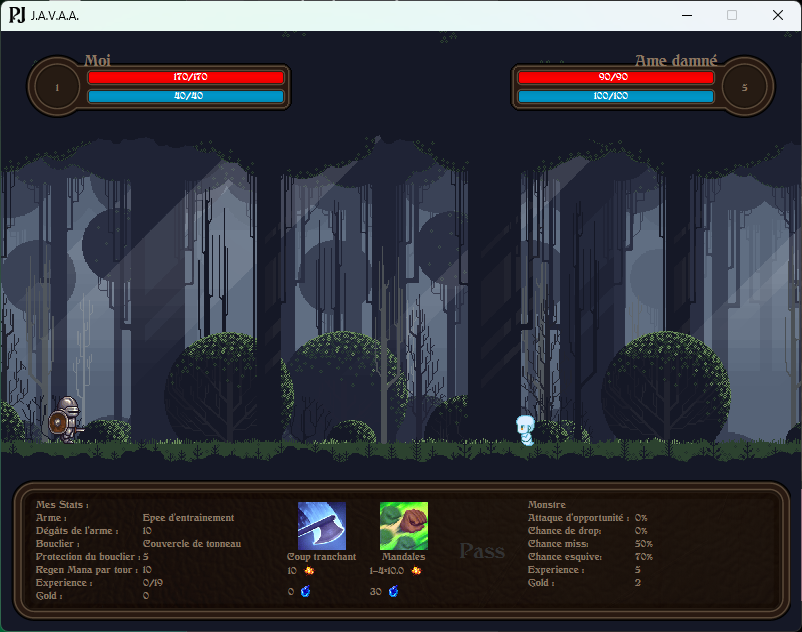 | 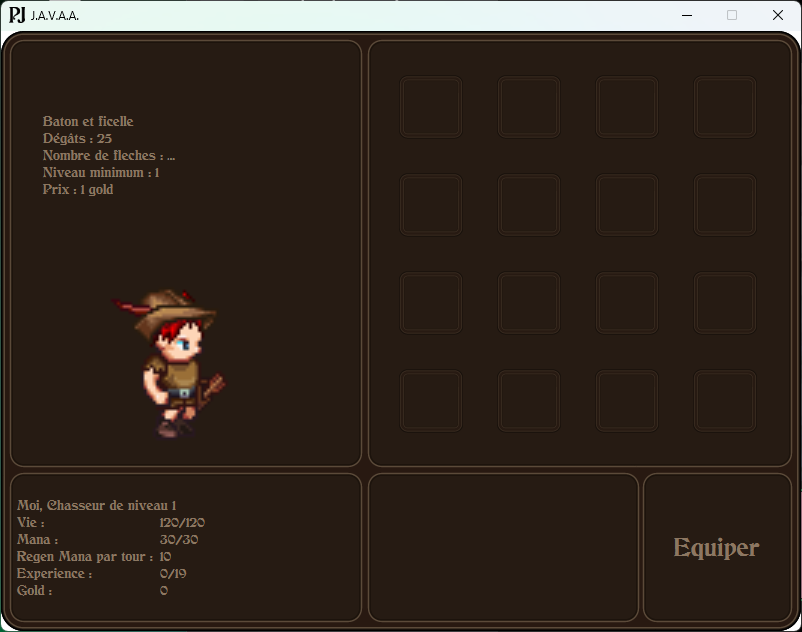 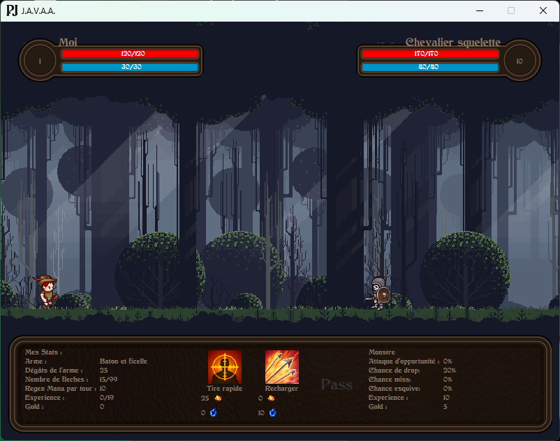 | 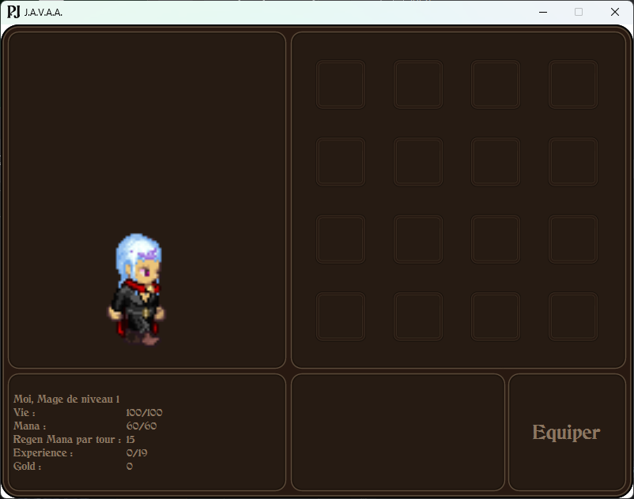 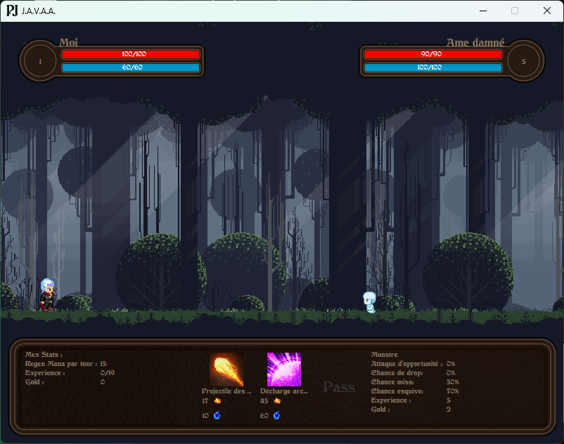 |
